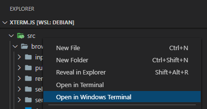

## Features

**Explorer context menu**

Open a particular Windows Terminal profile on a folder via the explorer's right click context menu.

**WSL Remote support**

The context menu also works in [WSL remotes](https://marketplace.visualstudio.com/items?itemName=ms-vscode-remote.remote-wsl), regardless of whether the terminal profile is WSL or not.

## Requirements

- [Windows Terminal](https://www.microsoft.com/en-us/p/windows-terminal/9n0dx20hk701) or [Windows Terminal Preview](https://www.microsoft.com/en-us/p/windows-terminal-preview/9n8g5rfz9xk3)

## Settings

| Key | Description |
|---|---|
| `windowsTerminal.channel` | Whether to the stable or the preview version of Windows Terminal |
